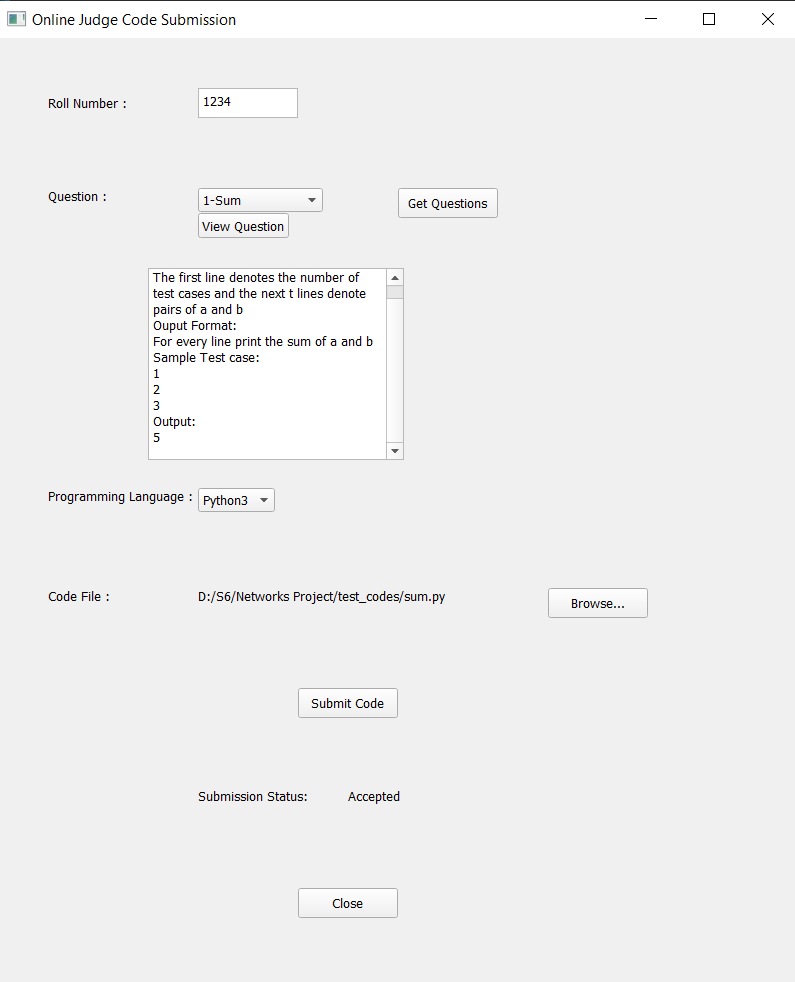

# Online-Judge
An online judge application using socket programming in Python. 

## Authors
- [Saran Sappa](https://github.com/saransappa)
- [Mullapudi Taraka Vignesh](https://github.com/mtarakavignesh)
- [Mudili Sandeep Naidu](https://github.com/sandeepnaidumudili)

## Tech Stack Used
- Python Socket Programming
- PyQt5 for GUI

## Our application's user interface
